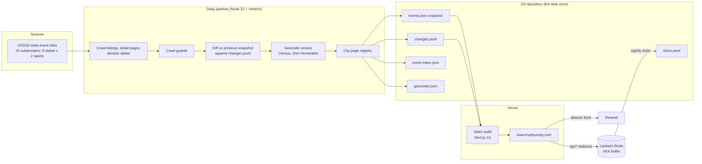

# TrueTourney — architecture notes

These notes describe the real system as of September 2026. They are derived from the private codebase; nothing here is aspirational. Where a feature exists only as a written spec (for example email alerts), it is called out as unbuilt.

## 1. System overview

TrueTourney is two projects in one repository:

1. **Data pipeline**: plain Node.js/TypeScript scripts that crawl, normalize, diff, geocode and commit tournament data.
2. **Site**: a Next.js 16 App Router application that imports the committed JSON at build time and renders every page statically.

**Scheduling.** A shell script runs under launchd on a Mac mini at 04:00 (America/Phoenix), with a MacBook Air at 06:15 as fallback and a Railway cron container (Node 22 slim + git) at 17:00 UTC as the last resort. Each runner checks git history for today's "Data refresh" commit and exits if another machine already crawled, so the source sees exactly one crawl per day. A GitHub Actions workflow exists for manual dispatch only, because the source's CDN blocks GitHub-hosted runners.

**Deploy.** The pipeline commits and pushes; Vercel's git integration rebuilds the site. A `vercel.json` `ignoreCommand` skips the build when nothing under the site directory changed, so click-log-only commits do not trigger deploys.

## 2. Data model

All primary data lives in committed files. There is no relational database.

| File | Purpose |
|---|---|
| `events.json` | Full current snapshot of every event and its divisions (~4.6 MB). Copied into the site's `src/data` and imported at build time. |
| `changes.jsonl` | Append-only diff log. One row per observed field change: timestamp, event id, event name, division (or null), field, old value, new value. A trailing 14-day window is bundled into the site to compute "+N teams this week". |
| `event-index.json` | Every event ever seen, keyed by id and never pruned, with first-seen and last-seen dates. Lets click and change rows for ended events still resolve to a name. |
| `geocodes.json` | Cache keyed by normalized address: lat/lon, source (census or nominatim), resolved-at; failed lookups are recorded and retried after 30 days. |
| `city-pages.json` | Registry of `state/sport/city` pages with the date each first qualified. Entries are never removed. |
| `clicks.jsonl` | Durable outbound-click log, drained from Redis nightly. |

**Event record.** Each event carries: an id namespaced by source (`usssa:<id>`), name, sport (`baseball` or `fastpitch`), sanctioning body, event type (for example NIT or State Qualifier), start and end dates plus the raw date text, city and state plus the raw location text, age range plus the raw age text, event-level entry fee, gate fee text, director name, teams entered, registration URL, a list of venues (name, raw address, city, state, zip) and a list of divisions (name, sub-label, age, class, entry fee, gate fee, max entries, teams entered, games guaranteed, format, registration URL). Bookkeeping fields record `divisions_status` (`ok`, `empty` or `error`), when it was scraped and when content last changed.

Raw strings are kept next to normalized values on purpose: a parsing fix can be applied to the stored snapshot without re-crawling.

**Identity.** Event identity is the numeric source id. Division identity for diffing is name + sub-label + occurrence index. URL slugs are `<name>-<id>`, and only the trailing id is authoritative, so a renamed event's old URL still resolves and redirects (308) to the canonical slug.

**Redis.** A single list key holds click rows pushed at request time. The nightly drain reads the list length, fetches that many rows, appends them to the committed log, then trims exactly the count it read so rows arriving mid-drain survive. Re-reads are de-duplicated on the file side, because a lost click cannot be recovered but a double count can.

## 3. Data pipeline

The daily script runs these stages in order; a failing crawl stops the run and nothing is committed.

1. **Sync**: `git pull --rebase --autostash`, reinstall dependencies if the lockfile changed.
2. **Drain clicks** from Redis and commit them separately (runs before the crawl guard so clicks land even on days another machine crawled).
3. **Crawl guard**: exit if today's refresh already exists in git history.
4. **Crawl** each of the 16 state-and-sport sites:
   - Listing pages are paged and parsed with cheerio.
   - Detail pages yield labelled fields, hidden form inputs and a venues table.
   - Divisions come from the source's WordPress admin-ajax endpoint, which requires a per-page nonce read from inline script data. (The nonce requirement appeared unannounced in September 2026 and broke one day's crawl; the crawler now fetches it fresh per event.)
   - Politeness: single-threaded, ~1.1 s between requests, a declared `TrueTourneyBot` user agent pointing to the public `/bot` page, and retries with 5 s / 20 s / 60 s backoff on 5xx and network errors. The source's disallowed API paths are never called.
5. **Suspect handling**: an empty division response only marks an event as suspect. It is re-asked at the end of that site's crawl (up to three bursts) and again in an end-of-run sweep. Only events empty in every time-separated pass are recorded as `empty`. Fetch errors mark the event `error` and the previous snapshot's divisions are carried forward rather than publishing an empty list.
6. **Crawl guards** refuse to overwrite the snapshot if any site returns zero events, more than 5% of division fetches errored, the total event count falls below half the previous snapshot, or the run would shed more divisions than a per-day budget allows (10 fully emptied events per day; partial losses capped at the larger of 25 or 4% of the previous snapshot, scaled by the baseline's age). Guard changes are validated by replaying them against every committed snapshot.
7. **Diff**: eleven event-level and six division-level fields are compared with the previous snapshot; additions, removals and changes are appended to the change log. Division churn is skipped when either side is in `error` status. `content_changed_at` is stamped only when content actually changed and feeds the sitemap's `lastmod`.
8. **Geocode** new venue addresses with the US Census batch geocoder first (public domain, no key), then Nominatim at one request per second as fallback. Google's geocoder is deliberately not used because of its caching and display terms. A no-op run makes zero network requests.
9. **City pages**: a city earns a page at three or more upcoming events and keeps it down to one.
10. **Commit and push** as the repository owner (required for Vercel's git integration to deploy), with pull-rebase-retry on conflict.

Logging is console output with per-site progress and field coverage. There is no paging; a failed run simply means no commit that day and the next rung of the ladder takes over.

## 4. Site

### Routes

| Route | Rendering | Notes |
|---|---|---|
| `/` | static | Organization and WebSite JSON-LD |
| `/[state]/[sport]` | static, `dynamicParams=false` | 16 hubs, CollectionPage/ItemList JSON-LD |
| `/[state]/[sport]/[filter]` | static | age (`12u`), month (`september-2026`) or city slug |
| `/event/[slug]` | static for upcoming, on-demand for stale slugs | SportsEvent + BreadcrumbList JSON-LD; past events 404; renamed slugs 308 |
| `/event/[slug]/opengraph-image` | generated | per-event Open Graph card via `next/og` |
| `/event/[slug]/calendar.ics` | dynamic | inline `.ics`; `?to=google` redirects to the Google Calendar flow |
| `/event/[slug]/google-calendar` | dynamic | HTML page that navigates to Google's template URL (works around iOS cold-start app handoff) |
| `/go/[eventId]` | dynamic | logs the click, 302 to the registration URL |
| `/go/hotel/[eventId]` | dynamic | logs the click, 302 to a hotel search with dates pre-filled |
| `/directors` | static + server action | submit or claim a tournament |
| `/bot`, `/privacy` | static | crawler disclosure and privacy notes |
| `sitemap.xml`, `robots.txt`, `llms.txt` | generated / static | robots allows all crawlers; disallows `/go/` and calendar endpoints |

Venue pages are built but intentionally unpublished (not linked, not in the sitemap) until they meet a quality bar.

### Filtering

Listing pages ship all of a hub's events to the client, and a single component filters by text and chip selection. Because chips are OR within a facet and AND across facets, the site can offer rich filtering without generating combined-facet pages that would be thin for search.

### Structured data and metadata

Every route builds its title and description from the data (fee span, date span, cities, holiday weekends), sets a canonical URL, and emits JSON-LD. Event pages describe the organizer as a Person or Organization by heuristic, every venue as a Place with postal address and coordinates, and each division as an Offer marked in stock or sold out from fill data. Outbound registration links are `nofollow`; affiliate links are `sponsored`; the event stats grid is `data-nosnippet`.

## 5. Key flows

### Authentication

There is none: no accounts, no admin UI, no protected endpoints. Director claims are verified manually by email reply. Operational tasks are local CLI scripts (click report, source probes).

### Director submissions (email)

The directors form posts to a Next.js server action. The action sends two plain-text emails through the Resend REST API: a notification to the directors inbox with reply-to set to the submitter, and a best-effort receipt to the submitter. Mail is sent from a dedicated sending subdomain so its DKIM records stay clear of the root domain's SPF and MX. Tracking is disabled. A honeypot field silently accepts bot submissions. If the email key is missing or Resend fails, the submission is logged and the user is offered a pre-filled `mailto:` fallback.

Email alerts and saved searches exist only as a written spec (Postgres tables, daily digest, one-click unsubscribe); none of it is built.

### Outbound click tracking

Registration, hotel and calendar links go through `/go/*` routes. Each route resolves the destination from the site's own data or a hardcoded template (no open redirects; unknown ids 404), then records a click row in Redis inside Next.js `after()` so the redirect is never delayed. Rows carry the timestamp, event id, destination, referrer, user agent, coarse geo from Vercel headers (country, region, city; never the IP), and a bot verdict from named, re-runnable rules (user agent, non-US geo, missing page referrer, and burst detection at report time). Rows are flagged, never dropped, and the report re-derives every verdict.

### Calendar

The `.ics` route generates the file inline; the Google path renders a tiny page that navigates to Google Calendar's template URL. This is the one part of the site with an automated test, run with `node:test`.

## 6. Deployment and operations

- **Hosting**: Vercel, project root set to the site directory, canonical host `www` with the apex redirecting.
- **Configuration**: environment variables for the Upstash REST URL and token (or the Vercel marketplace aliases), the Resend API key and optional from-address, source-probe credentials used only by the pipeline, and a fine-grained GitHub token for the Railway runner. Pipeline scripts load a local `.env` with a small hand-rolled parser; there is no dotenv dependency.
- **Runtime dependencies**: the pipeline depends on cheerio only. The site has no component library and no client-side analytics beyond Vercel Analytics and Speed Insights (cookieless).
- **Privacy**: the site sets no cookies, has no accounts, and stores only coarse geo on click rows.
- **Testing and checks**: TypeScript strict mode across both projects, a `node:test` suite for calendar links, and crawl-guard replays against committed snapshots. There is no CI pipeline for lint or build; Vercel's build is the gate.
- **Failure modes**: a bad crawl produces no commit; a Redis outage loses that day's click rows but never blocks a redirect; an email outage degrades to a `mailto:` link.

## 7. Timeline

| Date | Milestone |
|---|---|
| 2026-08-15 | Pipeline scaffolded: normalized schema and crawler for Texas and Tennessee |
| 2026-08-25 | Arkansas and Mississippi launched |
| 2026-09-08 | Georgia and Alabama launched |
| 2026-09-11 | Source added a nonce requirement; crawler updated same day |
| 2026-09-22 | Louisiana and Florida launched (all eight states live) |
| 2026-09-24 | Division-shed guard split into two budgets; longer retry window |

About 265 commits in the first six weeks, of which roughly 100 are automated data-refresh and click-log commits.
