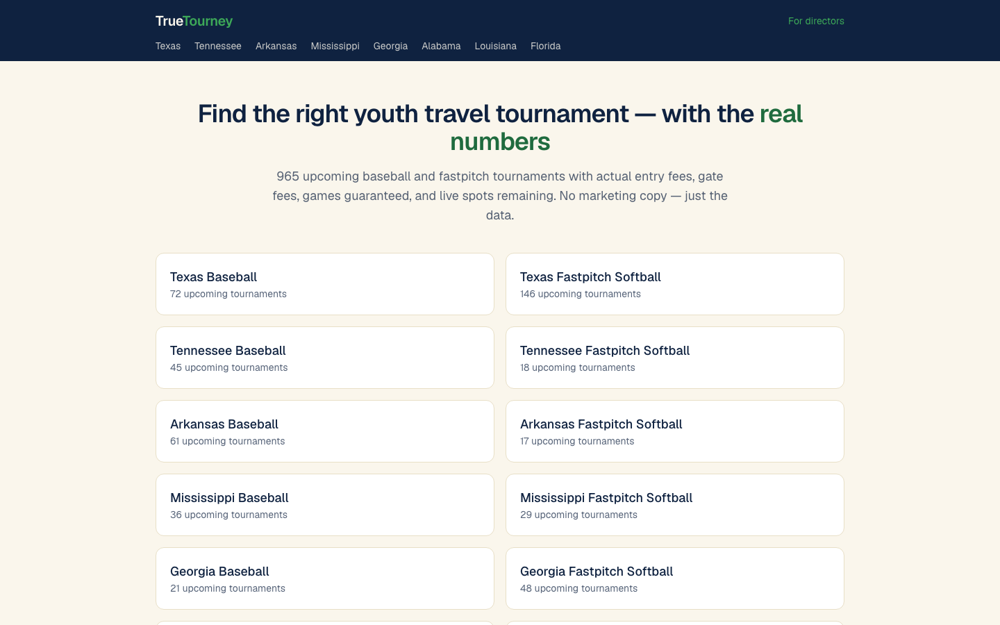
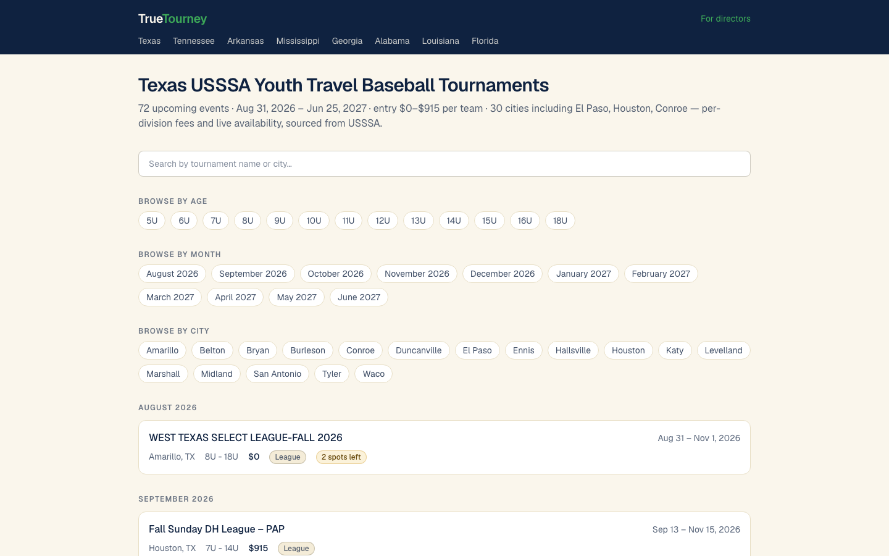
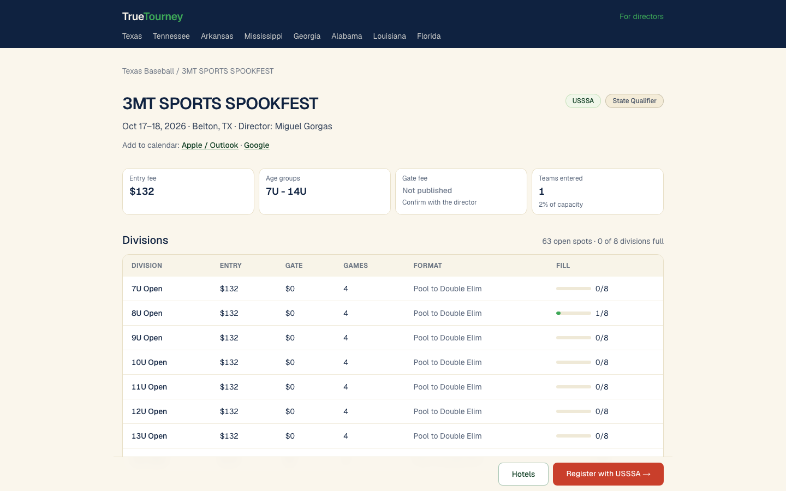

# TrueTourney — youth sports tournament directory

**Live:** https://www.truetourney.com/
**Built and operated by:** [Joshua Winningham](https://www.joshwinningham.com)

> The source code for TrueTourney is private. This repository is a public showcase: a product overview, [architecture notes](ARCHITECTURE.md) derived from the real codebase, and [screenshots](screenshots/) of the live product. A code walkthrough is available on request via https://www.joshwinningham.com/#contact.

## What it does

TrueTourney is a directory of youth travel baseball and fastpitch softball tournaments across eight southeastern US states (Texas, Tennessee, Arkansas, Mississippi, Georgia, Alabama, Louisiana and Florida). Instead of marketing copy, every listing shows the numbers families actually compare: entry fee, gate fee, games guaranteed, and live spots remaining, broken down by division.

The data comes from a scheduled crawl of public USSSA state event sites, normalized into one schema and republished as a fully static Next.js site that rebuilds after every refresh. As of late September 2026 the site lists roughly 965 upcoming events and 8,900 divisions across 16 state-and-sport hubs and about 190 city pages.

## Who uses it

- **Families and coaches** comparing weekends: browse by state, sport, age group, month or city, filter instantly, then jump to the sanctioning body's registration page.
- **Tournament directors**: list a new event or claim an existing listing for free through the directors form, with the option to publish their contact details and logo.
- **Search engines and AI assistants**: every page carries structured data (SportsEvent, CollectionPage, Organization) and a public `/bot` page documents the crawler.

## My role

I designed, built, deployed and operate TrueTourney solo: product scope, the data pipeline, the Next.js site, SEO, email, hosting and the daily operations that keep the data fresh. The project started in mid-August 2026 and reached all eight states by late September 2026 through phased state launches.

## Key features

- **State and sport hubs** with facet pages by age group (5U–18U), month and city, all statically generated.
- **Instant client-side filtering** by typing or clicking chips; chips combine with OR inside a facet and AND across facets, so no combined-facet pages are needed.
- **Event detail pages** with per-division entry fee, gate fee, games guaranteed, format and fill, plus "+N teams this week" momentum derived from the change log.
- **Add to calendar** (Apple/Outlook `.ics` and Google Calendar) and directions links for every venue.
- **Registration and hotel links** through logged, bot-filtered redirects, so outbound clicks can be reported without any client-side tracking script.
- **Director submissions and claims** with email notification and receipt, verified manually.
- **Data quality guards** that refuse to overwrite a good snapshot with an incomplete crawl, and an append-only change history behind every listing.
- **Search-ready output**: per-page metadata built from the data, JSON-LD, dynamic Open Graph images, sitemap with real `lastmod`, `llms.txt`.

## Tech stack

| Layer | Choice |
|---|---|
| Site | Next.js 16 (App Router), React 19, TypeScript, Tailwind CSS v4 |
| Data pipeline | Node.js 22, TypeScript, cheerio (HTML parsing), native `fetch` |
| Data store | JSON snapshots and an append-only change log committed to git |
| Click buffer | Upstash Redis (REST) |
| Email | Resend (director notifications and receipts) |
| Geocoding | US Census Geocoder, Nominatim fallback, committed cache |
| Hosting | Vercel (static build, Analytics, Speed Insights) |
| Scheduling | launchd on two Macs, Railway cron container as last resort |

## Why it's built this way

- **Git is the database.** Snapshots, the change log, the event identity index, geocodes and click logs are committed files. That gives complete history for free, lets the site be purely static, and means a bad crawl can never corrupt production: if the guards reject a run, nothing is committed and yesterday's site stays up.
- **Static site, rebuilt per data commit.** A directory that changes once a day does not need a database behind every request. Every page renders in the build, and Vercel's git integration redeploys only when files under the site change.
- **Redis only as a buffer.** Outbound clicks are the one thing that happens at request time. They are pushed to a Redis list and drained nightly into the committed log, so the durable record stays in git and the runtime dependency stays tiny.
- **Trust the numbers, not the source.** The upstream division endpoint intermittently answers "no data" for about 5% of events. The pipeline treats an empty answer as a suspect, re-asks later in the run, carries known divisions forward on error, and caps how many divisions any single day is allowed to remove. Raw source strings are stored beside normalized values so a parsing bug can be fixed without re-crawling.
- **Compliance first.** Only one source is crawled, after a written terms-of-use and robots.txt review. The crawler is single-threaded at roughly one request per second, announces itself with a named user agent and a public `/bot` page, stores no youth personal data, and publishes director contact details only when the director opts in.
- **Launch switches, not rewrites.** Adding a state is a one-line change in a list; city pages are earned by event count and persist once created, protecting the search equity of every URL.

## Screenshots

| | |
|---|---|
|  |  |
|  |  |

## Source and walkthrough

The production repository is private because it contains the crawler, operational scripts and data. I am happy to walk through the code, the pipeline guards and the deployment on a call: **https://www.joshwinningham.com/#contact**.
